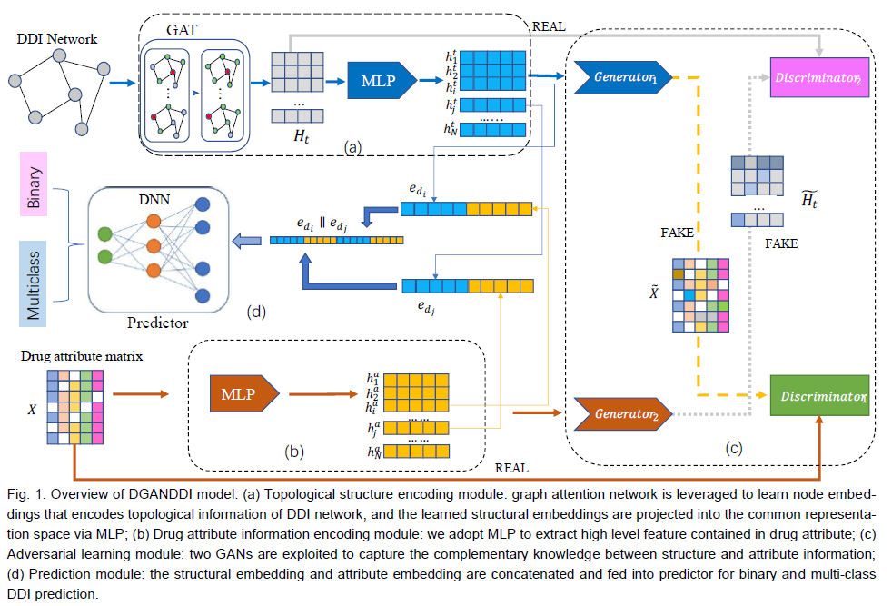

# DGANDDI
Source code for ["DGANDDI: Double Generative adversarial Networks for Drug-drug Interaction Prediction"](https://ieeexplore.ieee.org/document/9963691)
   
  

## Required packages
* Python == 3.8
* [PyTorch](https://pytorch.org/) == 1.7
* [PyTorch Geometry](https://pytorch-geometric.readthedocs.io/) == 1.7

## File description
### Binary-DDI-Prediction
This folder contains the source code files and dataset for binary DDI prediction problem. The details of each file are the following:

-  KnownDDI.csv —— contains the all the known DDIs used in our paper. It consists of 192, 284 DDIs with 86 relation types.

-  negative_samples.csv —— contains the negative samples which are obtained by random negative sampling.
 
-  drug_sim.csv —— contains the pair of drugs similarity which is used as drug attributes. 

- main.py —— contains codes for model training and testing.

-  train_on_fold.py —— contains codes for cross-validation.

### Multi-DDI-Prediction
This folder contains the source code files and dataset for multi-class DDI prediction problem. The details of each file are similar to binary case.

## Usage example 
    python main.py --n_epochs 50 --batch_size 1000 --lr 0.001

Arguments:

    --n_epochs Number of training epoches.
    --batch_size Batch size of DDI triplets.
    --lr learninig rate.
 
